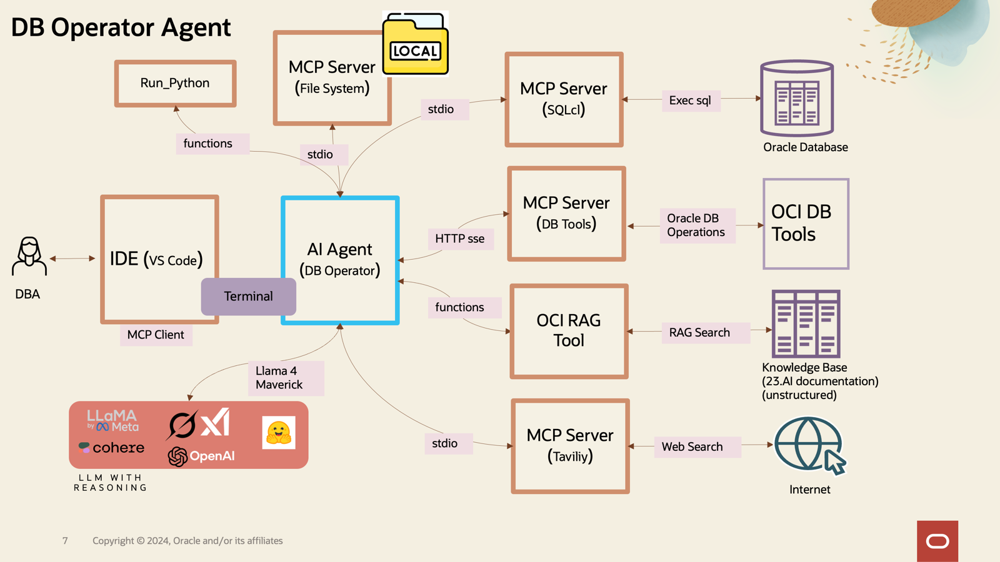

#### Model Context Protocol (MCP) is an open standard that enables developers to build secure, two‑way connections between their data sources and AI-powered tools, acting like a “USB‑C port” for AI models to access external context

Getting started with OCI Agents in 2 step :

### Step 1) Configure MCP Server
> Follow the steps per this document to configure MCP Server for SQLcli: 

> https://docs.oracle.com/en/database/oracle/sql-developer-command-line/25.2/sqcug/using-oracle-sqlcl-mcp-server.html

### Step 2) Configure your development environment
> Fork the repository
> https://github.com/aojah1/mcp
> 
> Clone the fork locally
> 
> git clone https://github.com/<your_user_name>/mcp.git

### Optional commands
    How to actually get Python 3.13 on macOS (change it for your machine)
    Option 1 : Homebrew (simplest)
    brew update
    brew install python@3.13          # puts python3.13 in /opt/homebrew/bin
    echo 'export PATH="/opt/homebrew/opt/python@3.13/bin:$PATH"' >> ~/.zshrc
    exec $SHELL                       # reload shell so python3.13 is found
    python3.13 --version              # → Python 3.13.x
    
    Option 2 : pyenv (lets you switch versions)
    brew install pyenv
    pyenv install 3.13.0
    pyenv global 3.13.0
    python --version                  # now 3.13.0

### Client Library
    cd mcp_client

### Configuring and running the agent
    python3.13 -m venv .venv_mcp
    source .venv_mcp/bin/activate

### Installing all the required packages

After you create a project and a virtual environment, install the latest version of required packages:
> python3.13 -m pip install -r requirements.txt

### Configuring your .env (config) file
> Rename the mcp_client/config/sample_.env to mcp_client/config/.env
> 
> Change the config variables based on your agents requirements

### Build/Deploy an DB Operator Agent
This agent integrates with Oracle DB SQLCl MCP Server, allowing NL conversation with any Oracle Database (19 c or higher).

https://docs.oracle.com/en/database/oracle/sql-developer-command-line/25.2/sqcug/using-oracle-sqlcl-mcp-server.html
> python3.13 -m src.agents.db_operator
> 
### Test DB Operator Agent

====================================

### DBA with Sys access
===================================

Connect to Oracle DB -
    show me all connections

    use adk_mcp1 to connect

Verify the Installation - 
    which user I am connecting with 

    list tablespace utilization and free space

    Verify database accessibility via sqlplus or SQL Developer

Document the Environment
    Record SID, DB name, listener ports, admin passwords (securely)

    Capture system architecture, version details, and patch level

========================================

### DB Developer with schema access only
=========================================

what schema I have access to 
going forward by default use the schema <<Your Schema >> every time

    create all the related tables as described in the following ERD. Use Oracle 23.AI JSON database type to create all the tables : 

    organizations
     ├── departments
     │    ├── employees
     │    │    └── roles
     │    └── budgets
     ├── goals
     │    └── objectives
     │         └── key_results
     └── projects
          ├── tasks
          └── milestones
